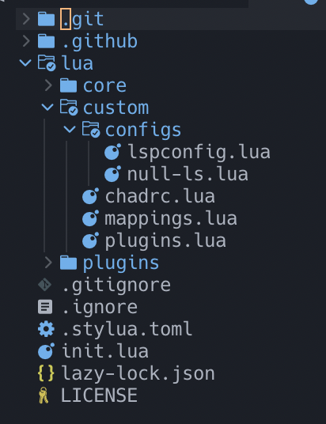

# Nvim + Nvchad

> Date : 09.18.2023

## Getting started

### From the very begining ...

- Install `nvim`
- Install font : `ttf-jetbrains-mono-nerd` ([Github link](https://github.com/ryanoasis/nerd-fonts))

### Remove previous nvim settings

> Skip if you haven't any previous settings.

```shell
mv ~/.config/nvim ~/.config/nvim.backup
rm -rf ~/.local/share/nvim
```

### Download Nvchad settings

```shell
git clone git@github.com:NvChad/NvChad.git ~/.config/nvim --depth 1
```

>  Note : PLZ use ssh connections if you are in China.

```shell
nvim
```

Do you want to install example custom config? (y/N) -- Type "N"

### Configs

```shell
cd /Users/linnan/.config/nvim
```



- `custom/configs/lspconfig.lua`

    ```lua
    local base = require("plugins.configs.lspconfig")
    local on_attach = base.on_attach 
    local capabilities = base.capabilities 
    
    local lspconfig = require("lspconfig")
    
    lspconfig.clangd.setup {
      on_attach = function(client, bufnr)
        client.server_capabilities.signatureHelpProvider = false
        on_attach(client, bufnr)
      end,
      capabilities = capabilities,
    }
    ```

- `custom/configs/null-ls.lua`

    ```lua
    local null_ls = require("null-ls")
    
    local opts = {
      sources = {
        null_ls.builtins.formatting.clang_format,
      }
    }
    
    return opts
    ```

    

- `custom/chadrc.lua`

    ```lua
    ---@type ChadrcConfig
    local M = {}
    
    M.ui = { theme = 'onedark' }
    M.plugins = "custom.plugins"
    M.mappings = require("custom.mappings")
    return M
    ```

- `custom/mappings.lua`

    ```lua
    local M = {}
    
    M.dap = {
      plugin = true,
      n = {
        ["<leader>db"] = {
          "<cmd> DapToggleBreakpoint <CR>",
          "Add breakpoint at line",
        },
        ["<leader>dr"] = {
          "<cmd> DapContinue <CR>",
          "Start or continue the debugger",
        }
      }
    }
    
    return M
    ```

- `custom/plugins.lua`, after copying the code, don't forget to install all the plugins : `:MasonInstallAll` !!!!

    ```lua
    local plugins = {
      {
        "rcarriga/nvim-dap-ui",
        event = "VeryLazy",
        dependencies = "mfussenegger/nvim-dap",
        config = function()
          local dap = require("dap")
          local dapui = require("dapui")
          dapui.setup()
          dap.listeners.after.event_initialized["dapui_config"] = function()
            dapui.open()
          end
          dap.listeners.before.event_terminated["dapui_config"] = function()
            dapui.close()
          end
          dap.listeners.before.event_exited["dapui_config"] = function()
            dapui.close()
          end
        end
      },
      {
        "jay-babu/mason-nvim-dap.nvim",
        event = "VeryLazy",
        dependencies = {
          "williamboman/mason.nvim",
          "mfussenegger/nvim-dap",
        },
        opts = {
          handlers = {},
        },
      },
      {
        "mfussenegger/nvim-dap",
        config = function(_, _)
          require("core.utils").load_mappings("dap")
        end
      },
      {
        "jose-elias-alvarez/null-ls.nvim",
        event = "VeryLazy",
        opts = function()
          return require "custom.configs.null-ls"
        end,
      },
      {
        "neovim/nvim-lspconfig",
        config = function()
          require "plugins.configs.lspconfig"
          require "custom.configs.lspconfig"
        end,
      },
      {
        "williamboman/mason.nvim",
        opts = {
          ensure_installed = {
            "clangd",
            "clang-format",
            "codelldb",
          }
        }
      }
    }
    return plugins
    ```

## Special configurations

### Insert Vimscript in lua files

```lua
-- Any Lua config file, e.g. init.lua
vim.cmd[[
   " Vimscript goes here!
]]
```

### Adding pluggins

- Open file `custom/plugins.lua`

- Type in contents : (`lervag/vimtex` is a repository name in [GitHub])

    ```lua
    local plugins = {
        {
            "lervag/vimtex",
        },
    }
    ```

## Usage doc

### Look for suggestions

- Press `Space` for a longer period of time

### File search

- **Search for files** : `Space + ff`
- **Search for files we have opened** (file buffers) : `Space + fb`

- **File tree** : `Ctrl + n` to open

    - `m` Mark file

    - `a` Create file

    - `c(opy)-p(aste)-r(ename)`

### Window navigation

- Create windows : `:vsp`, :`:sp`
- Move between window : `Ctrl + hjkl`
- Pick window : `ABCD ...`

### Tabbufline

- Move between buffers : `Tab`

### Terminal

- `Space + h/v`

## Reference

- [The perfect Neovim setup for C++](https://www.youtube.com/watch?v=lsFoZIg-oDs)